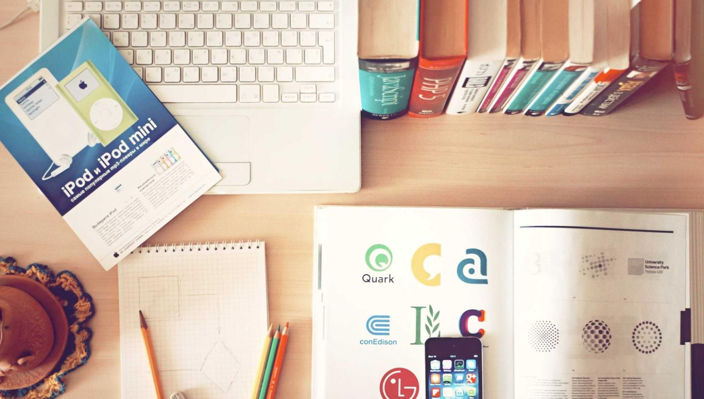

# DSPLAY - Skitter Slider

A jQuery [HTML-based template](https://developers.dsplay.tv/docs/html-templates) for the
[DSPLAY - Digital Signage](https://dsplay.tv/) platform — a full-screen image slideshow with many transition
styles, powered by the [Skitter](http://www.gustavowb.com/skitter/) jQuery plugin.

## Supported screen formats

| Landscape | Portrait | Square |
|-----------|----------|--------|
|  |  |  |

| Horizontal banner |
|--------------------|
|  |

> Vertical banner is omitted: Skitter's built-in responsive breakpoints (`small` below 768px width) rewrite the image URL to insert a `-small` filename suffix for narrower screens, expecting a matching pre-generated variant to exist. The demo images used here (and any extensionless/query-string image URL) have no such variant, so at the 200px-wide vertical banner format the rewritten URL 404s and no image loads at all — confirmed via the page showing Skitter's own "Error loading images" message with zero `` elements rendered. This is an inherent limitation of the plugin's responsive-image feature at extreme aspect ratios, not something fixable by CSS alone.

This README has two audiences:
- **[Building your own template](#building-your-own-template)** — if you cloned this repo to create a new DSPLAY template.
- **[Maintaining this boilerplate](#maintaining-this-boilerplate)** — for the DSPLAY team, keeping this repo itself up to date.

---

## Building your own template

### Getting started

1. Clone or download this repository into your own new project folder.
2. Detach it from this repo's history — you're starting a template of your own, not contributing back here:
   ```sh
   rm -rf .git
   git init
   ```
3. Install the packaging-time tooling (only needed once):
   ```sh
   npm install
   ```
4. Serve it with live reload:
   ```sh
   npm start
   ```
   and visit `http://localhost:3000` (visit the root URL, not `http://localhost:3000/index.html` directly — the reload script is only injected on that path). The page auto-reloads whenever you edit and save a file.

### Template variables

| Key         | Type      | Description                                                    |
|-------------|-----------|-------------------------------------------------------------------|
| `animation` | selection | The slide transition effect. One of: `cube`, `cubeRandom`, `block`, `cubeStop`, `cubeHide`, `cubeSize`, `horizontal`, `showBars`, `showBarsRandom`, `tube`, `fade`, `fadeFour`, `paralell`, `blind`, `blindHeight`, `blindWidth`, `directionTop`, `directionBottom`, `directionRight`, `directionLeft`, `cubeStopRandom`, `cubeSpread`, `cubeJelly`, `glassCube`, `glassBlock`, `circles`, `circlesInside`, `circlesRotate`, `cubeShow`, `upBars`, `downBars`, `hideBars`, `swapBars`, `swapBarsBack`, `swapBlocks`, `cut`, `random`, `randomSmart`. Defaults to `fade`. |

> Remember to also register this as a Template Var (same name and type) when configuring this template in the DSPLAY CMS.

> New variable names should use `snake_case` (e.g. `background_color`, not `backgroundColor`) — the DSPLAY CMS Manager auto-generates each variable's label from its key, and snake_case reads more naturally there.

Slide images themselves come from the media, not from a Template Var — see `scripts/app.js`: either a plain
`media.images` URL list, or an Instagram-post-shaped `media.result.data.posts[].media[]` structure.

### Local development

`scripts/dsplay-data.js` defines `dsplay_config`/`dsplay_media`/`dsplay_template` mock globals, used **only** when
the template isn't running inside the actual DSPLAY app. Edit it to try out different images/animations.

### Generating the template package

```sh
npm run zip
```

This first runs [`dsplay-scan-template`](https://www.npmjs.com/package/@dsplay/template-manifest), which
statically scans `scripts/app.js` for `dsplayTemplateUtils.tval`/`tbval`/`tival`/`tfval` calls and captures
`dsplay-data.js` as example data — writing `template-variables.json` + `template-example-data.json` to the project
root. The DSPLAY CMS reads these two files to auto-detect this template's variables and seed default preview
values, instead of requiring manual registration.

It then zips `index.html`, `images/`, `scripts/`, `styles/`, and the two generated JSON files into `template.zip`.

> **IMPORTANT**: `index.html` must be located in the root of the `.zip` file, not inside any folder — `pack.sh`
> already takes care of this.

`template.zip`, `node_modules/`, and the two generated JSON files are gitignored and should never be committed;
`npm run zip` regenerates them every run.

### Deploying

Upload the resulting `template.zip` to the [DSPLAY Web Manager](https://manager.dsplay.tv/template/create).

---

## Maintaining this boilerplate

This section is for the DSPLAY team, keeping this template itself current.

### Updating vendored dependencies

jQuery, `core-js`, and `dsplay-template-utils.js` are pre-built bundles downloaded from a CDN and committed as-is
(not installed via npm). Run:

```sh
npm run update-deps
```

It checks the latest published version of each dependency and updates the vendored file + the `<script src="...">`
reference in `index.html` accordingly. **Major version bumps are skipped with a warning** rather than applied
automatically — review the linked changelog and update manually if you want to take a major bump. jQuery
currently has one pending (3.6.1 → 4.x), deliberately left unapplied — see AGENTS.md.

`jquery.easing.min.js` and `jquery.skitter.min.js` (the Skitter plugin itself) are old, unmaintained third-party
files not published under a stable npm package name, so `update-deps.sh` doesn't touch them — they're a frozen
dependency.

The currently-vendored version of each dependency is tracked in `scripts/.vendored-versions.json`.

After running it, review the diff, test locally, and commit.

### Commit conventions

See [AGENTS.md](AGENTS.md).

## More

To see more about DSPLAY HTML Templates, visit: https://developers.dsplay.tv/docs/html-templates
